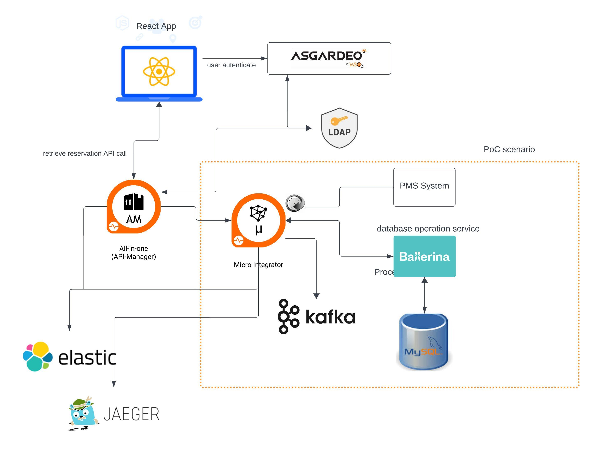

# HospitalityPOC: Proof of Concept Setup Guide

Welcome to the HospitalityPOC setup guide. This document outlines the steps necessary to set up the Proof of Concept (PoC) for our hospitality integration platform, which focuses on managing and processing walk-in reservation data from hotels.

## Overview

The PoC aims to demonstrate the following functionalities:

- **Data Extraction**: Integration with the Hotel's Property Management System to consume nightly event data.
- **Real-time Integration**: Processing walk-in reservation data in real-time.
- **Data Load to DB**: Loading data into a designated database.
- **Data Validation**: Ensuring data accuracy and adherence to business rules.
- **Error Handling and Logging**: Effective management of errors and logging for troubleshooting.
- **Monitoring and Alerting**: Overseeing integration processes and alerting for critical issues.
- **Data Privacy and Security**: Upholding data confidentiality and integrity.
- **Audit Trail**: Maintaining a detailed record of all integration activities.
- **Access Controlled App**: Providing regional administrators access to reservation data.

## Software Requirements

Before starting, ensure you have the following software installed:

- **Developer Studio**: Essential for development.
- **MI Runtime**: Required for running integrations.
- **APIM Runtime**: Necessary for API management.
- **Kafka**: Version 2.12-2.3.0 recommended. Download or use Kafka Docker. Link: [Kafka 2.3.0](https://archive.apache.org/dist/kafka/2.3.0/kafka_2.12-2.3.0.tgz).
- **MariaDB**: Use the MariaDB Docker image. Run with: 

For DB management, [DBeaver](https://dbeaver.io/) is recommended.
- MariaDB JDBC Driver: [Download here](https://mariadb.com/kb/en/installing-mariadb-connectorj/).
- Connection String: `jdbc:mariadb://localhost:3306/database_name`
- Driver Class: `org.mariadb.jdbc.Driver`
- **Kafka Docker Setup**: Use the `docker-compose.yaml` file from the provided GDrive folder.

## Setup Instructions

### 1. Repository Setup
Clone or fork the main repository:https://github.com/viggnah/HospitalityPOC/tree/main

### 2. PMS Backend Setup
Navigate to the `backends/pms` directory and initiate the PMC service:

### 3. Database Operations
In the `Integration/Ballerina/dbops` directory, check configurations and run the Ballerina service:

### 4. Integration Project
Install Integration Studio and open the project located in `Integration/MI/hospitalityIntegrationDemo`. Set the necessary environment variables.

### 5. Running the Integration
Within Integration Studio:
- Run the Micro Integrator project.
- Add the MySQL connector.
- Execute the composite application and monitor the logs.

## Conclusion

By following these steps, you should have a fully functional PoC setup for the hospitality integration platform. This will enable you to test and demonstrate the capabilities of real-time data processing and integration in a hospitality setting.
